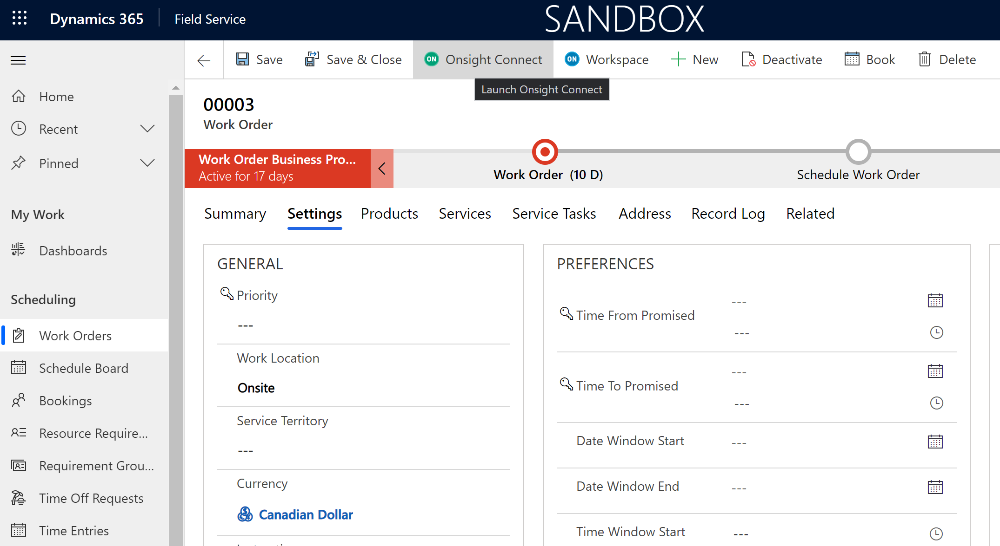
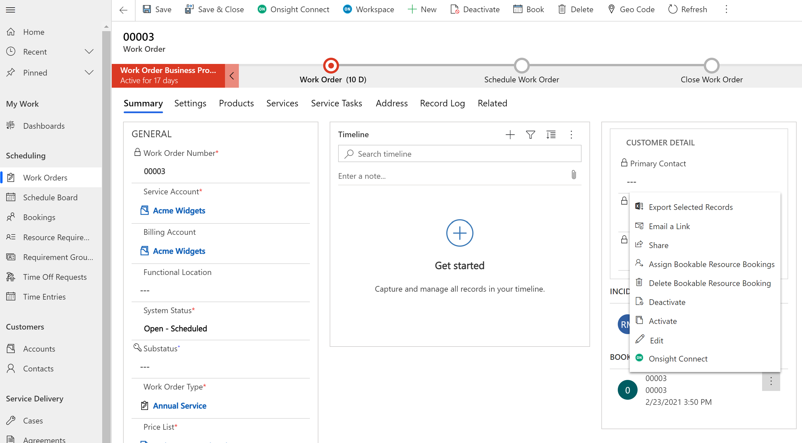
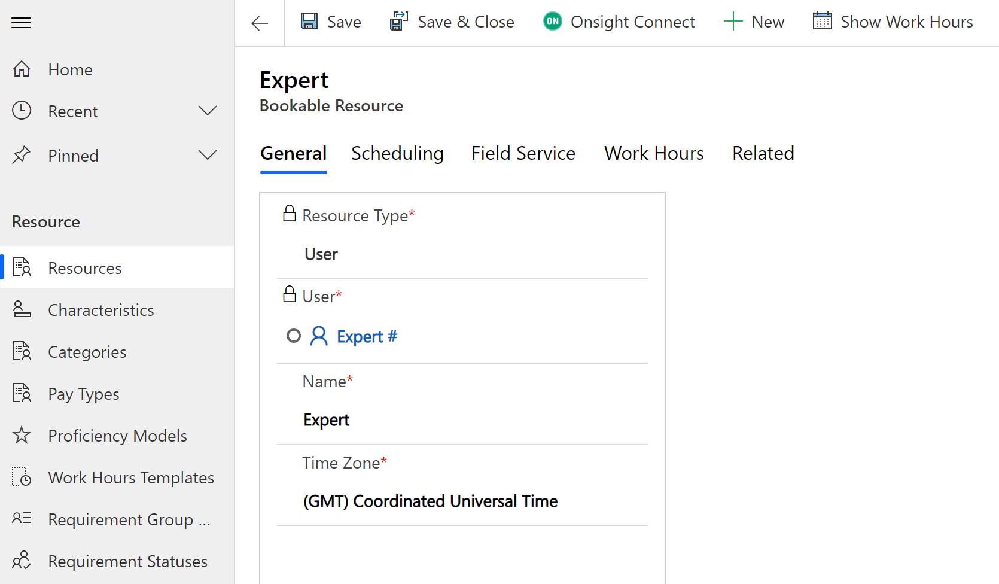
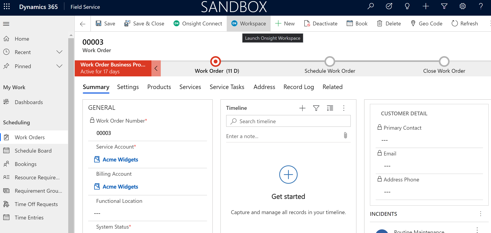
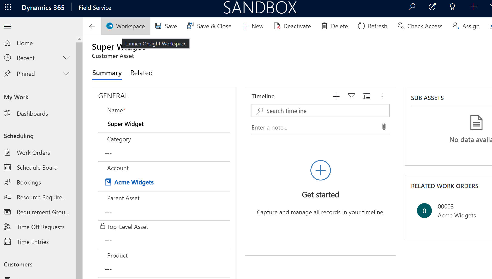

# Dynamics 365 Integration

## Overview

The Onsight Connect and Workspace integration consists of two Dynamics 365 solutions:
* Onsight Connect
    - Contains ribbon/command bar buttons for Connect and Workspace, with hooks
      into the custom javascript handlers for each button.
* Onsight Connect resources
    - JavaScript customizations
    - Command Button icons
    - Environment variable "OnsightAPIKey" for the end customer's Onsight API key.

The integration is split into two solutions due to limitations in the Ribbon Workbench editor, the tool used to add custom buttons to the D365 ribbon/command bar.

Both solutions have been left as "unmanaged", meaning that they can both continue to be modified as needed.

## Pre-requisites

The Onsight Connector stores your Onsight API key in an environment variable. In order to read this variable's value at runtime, each user must have the *Environment Variable Definition* permission enabled. The easiest way to enable this is by enabling it on one or more user roles within Dynamics 365's *Advanced Settings > Security > Security Roles* page, under the **Custom Entities** tab.

## Installation

In the project source's root directory, a Powershell script, *bundle.ps1*, should be run. This will generate several artifacts within the *build* subdirectory. The main artifact, *bundle/Onsight_Dynamics_365_Field_Service_Connector.zip*, is an AppSource package which can be published to Microsoft's AppPackage store. However, for development or testing purposes, the Connectors's solutions can be uploaded directly to a D365 installation, as follows:

1) From your Dynamics 365 account, navigate to the Power Apps site.
2) Select *Solutions* from the left-hand navigation panel.
3) From the top toolbar, select *Import*.
4) From your local build/stage02/PkgFolder, upload the two zip files:
   1) onsight_d365_connector.zip
   2) onsight_d365_connector_resources.zip
5) Ensure that both solutions are now listed under *Solutions*.
6) Click on the *Onsight Connect resources* solution.
7) Click on the *OnsightAPIKey* list item. A panel should open up on the right-hand side.
8)  In the *Current Value* text box, enter your Onsight API Key and click the Save button.

## Using the Integration

### Launching Onsight Connect
* From the Work Order main form:

    - This calls the first Bookable Resource Booking (i.e., field worker) assigned to the Work Order
        - Design Note: this is based on the "EmailMappings" JSON structure (in new_OnsightConnectApi.js) which assumes a WorkOrder will map to a single systemuser (it could map to several systemusers, as a WorkOrder is a complex entity).
        Future enhancements might require the EmailMapping structure to yield multiple systemusers for a single WorkOrder, such as the Support Contact/Expert, and any
        additional Bookable Resource Bookings.
        - When creating the Onsight Connect call, the Work Order ID and the Work Order's primary Customer Asset ID are sent as metadata and can be later queried using Workspace.
* From other locations (see **IMPORTANT NOTE** below)
    - From the Bookings sub grid:
        
    - From the Bookable Resource booking dialog:
        
    - From the Bookable Resource main form:
        

#### IMPORTANT NOTE:
If launching Onsight Connect from *anywhere other than* the Work Order's main form, there will be no Work Order in context. In other words, Onsight Connect can be launched, but no Work Order-related metadata will be available and associated with the subsequent call.

### Launching Workspace
* From the Work Order main form:

The Work Order ID will be used as the Workspace search term.
* From the Customer Asset main form:

The Customer Asset ID will be used as the Workspace search term.
