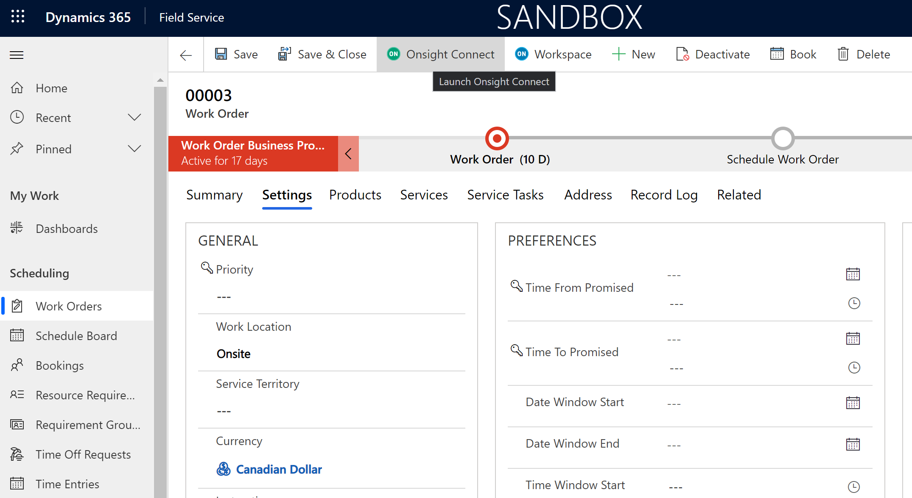
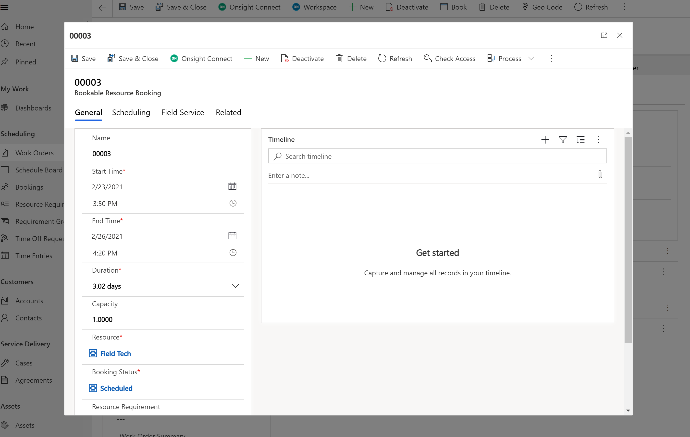
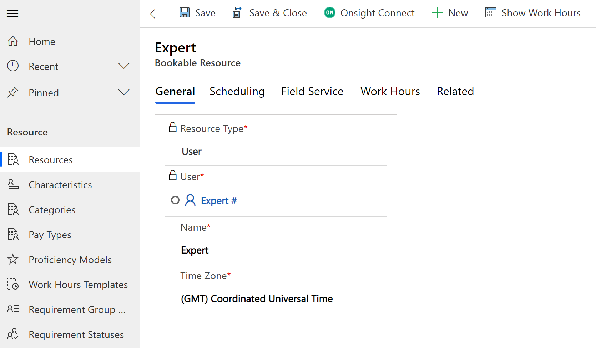
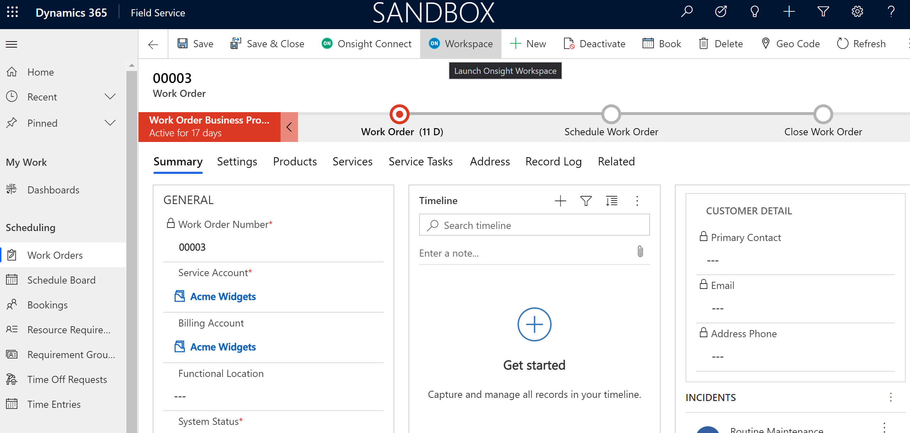

# Dynamics 365 Integration

## Overview

The Librestream Onsight Connector provides integration within Dynamics 365 to Onsight Connect and Onsight Workspace. It is inherently difficult to provide a one-size-fits-all solution when integrating with a CRM system; however, this integration provides support for a common use case:

- From within a Dynamics record (Work Order, Case, etc.) the current user can initiate an Onsight Connect call with a customer or subject matter expert. This other person is identified from a designated field within the Dynamics record.
- A ribbon button ("Onsight Connect") is provided within the user interface which initiates this Onsight call between the current user and the other person.
- When clicked, the button gathers the required information and makes an Onsight API [invocation](solutions/onsight_d365_connector_resources/WebResources/new_OnsightConnectApi5D43C8CC-C976-EB11-A812-000D3AF3FF5E.js#:~:text=launchOnsightConnect) to obtain a Call URL.
- Once the Onsight Call URL has been returned by the API, the user's browser is directed to this Call URL and the call begins.

There are three options for deploying the integration:

1) Use the reference integration as-is by [installing from the Microsoft AppSource catalog](#install_from_appsource).
2) [Build/package from source](#build_from_source), optionally including your own modifications, and deploy to your tenant. There is a convenient [PowerShell build script](bundle.ps1) which bundles the source code and resources into a single zip archive.
3) [Write your own solution from scratch](#build_from_scratch), using the code provided here as a starting point.

##  Option 1: Install from Microsoft AppSource Catalog

To install the default Connector into your D365 tenant, go to the Microsoft AppSource site, https://appsource.microsoft.com/, and search for "Onsight Field Service Connector".

From the *Onsight Dynamics 365 Field Service Connector* page, click the "Get It Now" button. After entering some contact information, click "Continue".

Select the D365 environment into which the Connector should be installed.

Once you have installed the default integration from the AppSource Catalog, you can skip to the [Post Installation](#post_installation) section.

##  Option 2: Build From Source

If you wish to modify the integration code or UI layout, you will need to create a solution archive prior to deployment. The PowerShell script, [bundle.ps1](bundle.ps1) can be used to create such an archive.

**NOTE: the bundle script requires Visual Studio 2019 in order to build OnsightD365Connector.dll; other versions of Visual Studio may be used, but if so, the first line in bundle.ps1 should be edited to indicate the location of MSBuild.exe.**

##  Option 3: Build from Scratch

If you are proficient in customizing Dynamics, building your own Onsight integration might be a good option, as it gives you full control over how and where the integration takes place. Building a Dynamics integration from scratch is not within the scope of this documentation. However, when looking at the existing reference implementation, a good starting point would be the [launchOnsightConnect function](solutions/onsight_d365_connector_resources/WebResources/new_OnsightConnectApi5D43C8CC-C976-EB11-A812-000D3AF3FF5E.js#:~:text=launchOnsightConnect). This function acts as the Onsight Connect button click handler and is the main entry point to integrating with Onsight Connect.

## Post Installation

After deploying (regardless of the chosen option), you must enter your Onsight API Key into the designated environment variable.

As a D365 administrator, go to the Power Apps Solutions page https://make.powerapps.com/environments/{tenantId}/solutions and open the Default Solution.

Under the Default Solution's Objects list, locate the Environment Variable named OnsightAPIKey. Open this Environment Variable and set its Current Value to your Onsight API Key. Click Save.

**NOTE: In order to read this variable's value at runtime, each user must have the *Environment Variable Definition* permission enabled. The easiest way to enable this is by enabling it on one or more user roles within Dynamics 365's *Advanced Settings > Security > Security Roles* page, under the *Custom Entities* tab.**

## Using the Integration

### Launching Onsight Connect
* From the Work Order main form:

    - This calls the first Bookable Resource Booking (i.e., field worker) assigned to the Work Order
        - Design Note: this is based on the "EmailMappings" JSON structure (in new_OnsightConnectApi.js) which assumes a WorkOrder will map to a single systemuser (it could map to several systemusers, as a WorkOrder is a complex entity).
        Future enhancements might require the EmailMapping structure to yield multiple systemusers for a single WorkOrder, such as the Support Contact/Expert, and any
        additional Bookable Resource Bookings.
        - When creating the Onsight Connect call, the Work Order ID and the Work Order's primary Customer Asset ID are sent as metadata and can be later queried using Workspace.
* From other locations (see **IMPORTANT NOTE** below)
    - From the Bookings sub grid:
        
    - From the Bookable Resource booking dialog:
        
    - From the Bookable Resource main form:
        

#### IMPORTANT NOTE:
If launching Onsight Connect from *anywhere other than* the Work Order's main form, there will be no Work Order in context. In other words, Onsight Connect can be launched, but no Work Order-related metadata will be available and associated with the subsequent call.

### Launching Workspace
* From the Work Order main form:

The Work Order ID will be used as the Workspace search term.
* From the Customer Asset main form:

The Customer Asset ID will be used as the Workspace search term.
